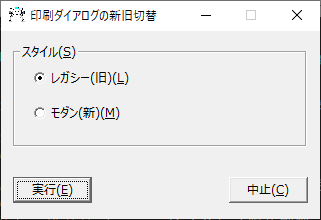

# LegacyPrintDlg - Windows 11 22H2 以降の Win32 アプリからの印刷ダイアログの新旧切替

Windows 11 22H2 以降で、Win32 アプリからの印刷ダイアログの新旧の切り替えがレジストリ操作で行えますが、
それを GUI 操作で行えるようにしたアプリです。

切り替えには権限の昇格が必要となります。
システムにより警告メッセージも表示されますが、続行して頂かないと切り替えられません。
利用者の責任でご利用ください。

2つのレジストリ(.reg)ファイルを同梱してあり、それを実行するだけのプログラムです。

[OWLNext7](https://sourceforge.net/projects/owlnext/) を使用した 64 ビット版の単一 .exe ファイルでできています。いまのところ日本語版だけです。

ライセンスは GPLv3 に従います。

## Link

Original Article

[Restore the Legacy Print Dialog in Windows 11 22H2](https://www.winhelponline.com/blog/restore-legacy-print-dialog-windows-11/)
