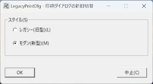
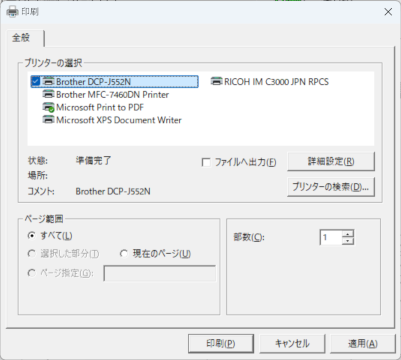
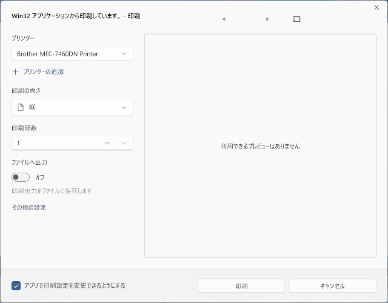

# LegacyPrintDlg - Windows 11 22H2 以降の Win32 アプリからの印刷ダイアログの新旧切替

[バイナリリリース](https://github.com/neige68/LegacyPrintDlg/releases)(Windows インストーラ) もあります。

Windows 11 (22H2 以降) では、Win32 アプリに対して新しい印刷ダイアログが導入されたことで、
印刷設定が正しく反映されないなどの問題が発生することがあります。

当アプリ LegacyPrintDlg は、印刷時のダイアログを旧型に切り替えることで、アプ
リ側が指定した印刷設定が確実に反映されるようにするためのツールです。

レジストリ操作でも行えますが、それを GUI 操作で行えるようにしたアプリです。

スクリーンショット 

レガシー(旧型)ダイアログの例 

モダン(新型)ダイアログの例 

切り替えには権限の昇格が必要となります。
システムにより警告メッセージも表示されますが、続行して頂かないと切り替えられません。
利用者の責任でご利用ください。

2つのレジストリ(.reg)ファイルを同梱してあり、それを実行するだけのプログラムです。

[OWLNext7](https://sourceforge.net/projects/owlnext/) を使用した 64 ビット版の単一 .exe ファイルでできています。いまのところ日本語版だけです。

ライセンスは GPLv3 に従います。

レジストリファイル(.reg)はハッシュをチェックしてますので、改変しないでください。

## ソースからのビルド方法

### 必要なもの

* [Git for Windows](https://gitforwindows.org/)

* [CMake](https://cmake.org/) 3.28 以上

* [Boost](https://www.boost.org/) 1.88 以上

* [OWLNext](https://sourceforge.net/projects/owlnext/) 7.0.19 以上

* [Visual Studio](https://visualstudio.microsoft.com/) 2022 の Visual C++ (VC 14.3)

### ソースファイルを取得

適当なディレクトリで

    git clone git@github.com:neige68/LegacyPrintDlg.git

### CMake

パスを通しておいてください

### Boost

CMakeLists.txt にて find_package で検索されます

### OWLNext

OWLNext のパスを環境変数 OWLROOT に設定しておくか、
CMakeLists.txt にて cmake 変数 OWL に set してください

    set OWLROOT=u:\lib\owl\7.0.19

### Visual C++

VC14.3 の vcvarsall.bat のあるディレクトリを環境変数 VC143 に設定しておくか、
build.bat にて環境変数 VC に set してください

    set VC143=C:\Program Files\Microsoft Visual Studio\2022\Community\VC\Auxiliary\Build

### ビルド

build.bat を実行してください

    build\src\debug\LegacyPrintDlg.exe   - デバッグ用
    build\src\release\LegacyPrintDlg.exe - リリース用
    
がビルドされ、レジストリファイルも同じディレクトリにコピーされます。

## Link

Original Article

[Restore the Legacy Print Dialog in Windows 11 22H2](https://www.winhelponline.com/blog/restore-legacy-print-dialog-windows-11/)
